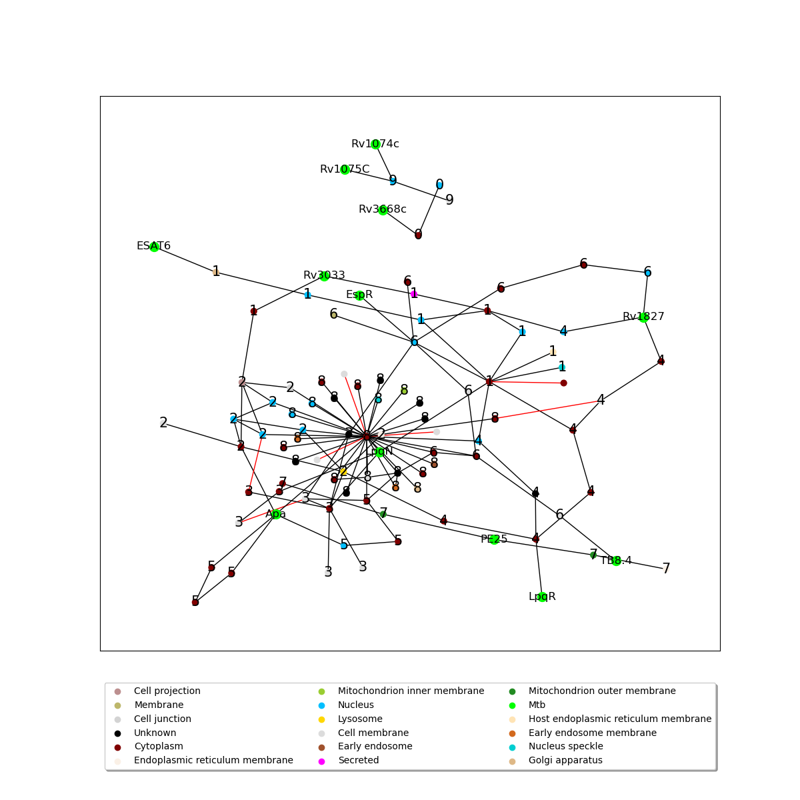

# Protein-Protein Interaction Predictions

## Background
Since most Protein-Protein Interaction databases are based off of experimentally observed protein interactions this leaves out the possibility of non-experimentally observed experiments. If you are running Graph Network analysis in any way, it may be beneficial to add non-experimentally observed interactions. One could try to find these online, or they could use a deep learning method to predict these interactions. We have developed in association with the University of Oregon and Parisa Hosseinzadeh a method to predict protein-protein interactions. Specifically in a context for graph network analysis. 


We have built this workflow using the APID and Uniprot databases to build a merged protein database. Then we filtered that data frame with Protien Atlas to pull out Macrophage specific proteins.

Our workflow assumes that you already have a NetworkX graph object with node features.

## Dependencies
This workflow currently uses:
- Python 3.6
- Keras
- Tensorflow
- StellarGraph
- NetworkX

To create a conda environment for this workflow type this into a bash command line:
```
conda create env -f ./stellar_env.yml
```

## Workflow
Currently this workflow has four scripts written in python that are sequentially run with the output from the script before it. The workflow is as stated:
1. `zachGraphLink.py`
2. `predict.py`
3. `newgraph.py`
4. `subgraphCreation.py`


## Predictions
Here is an example of the output that can be expected from the whole pipeline:



## Future Directions
Make it so that you can put any dataset in with any type/amount of features. This may mean we have to limit the type of inputs that can be put into the dataset first. As in we need a cleaning of the data, before it can be run in the workflow. 

Addition of SnakeMake, so that we would only need to run one command to run the entire workflow. It will make it easier for anyone to run the pipeline.
